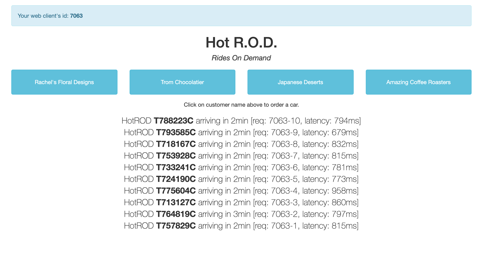
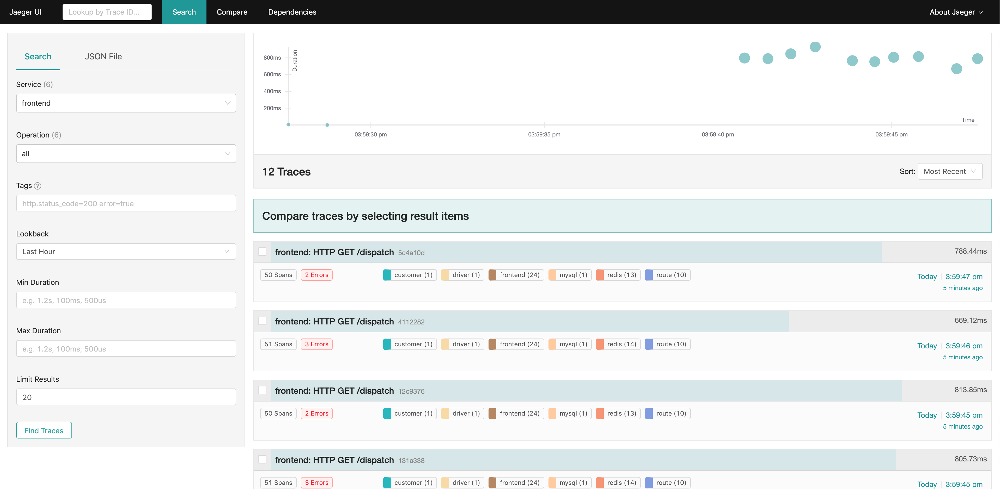
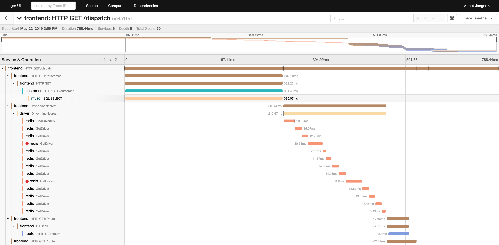
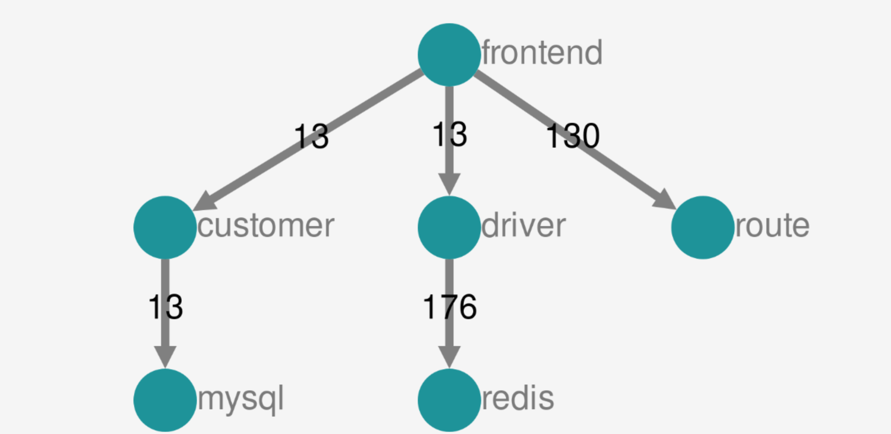
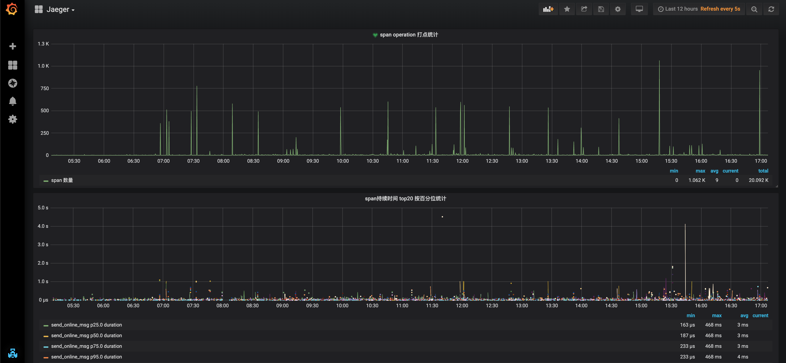

# 利用Jaeger打造云原生架构下分布式追踪系统

随着应用容器化和微服务的兴起，借由`Docker`和 `Kubernetes`等工具, 服务的快速开发和部署成为可能，构建微服务应用变得越来越简单。
但是随着大型单体应用拆分为微服务，服务之间的依赖和调用变得极为复杂，这些服务可能是不同团队开发的，可能基于不同的语言，服务之间的调用和通讯可能是基于rpc, 可能是基于restful api 还可能是通过消息队列等。如何在这样的环境下迅速debug和排查线上问题, 如何理清服务依赖调用关系，追踪各服务处理耗时和查找性能瓶颈, 对服务的容量评估变成一个棘手的事情。

## `可观察性`(Observability)

为了应对这些问题，可观察性概念被引入，目前定义的可观察性目前主要包含以下三个方面

- 日志(Logging)
- 度量(Metrics)
- 分布式追踪(Tracing)


Logging，Metrics 和 Tracing 有各自专注的部分， 这三者也有相互重叠的部分，


> Metric的特点是，它是可累加的：他们具有原子性，每个都是一个逻辑计量单元，或者一个时间段内的柱状图。 例如：队列的当前深度可以被定义为一个计量单元，在写入或读取时被更新统计； 输入HTTP请求的数量可以被定义为一个计数器，用于简单累加； 请求的执行时间可以被定义为一个柱状图，在指定时间片上更新和统计汇总。

> Logging的特点是，它描述一些离散的（不连续的）事件。 例如：应用通过一个滚动的文件输出debug或error信息，并通过日志收集系统，存储到Elasticsearch中； 审批明细信息通过Kafka，存储到数据库（BigTable）中； 又或者，特定请求的元数据信息，从服务请求中剥离出来，发送给一个异常收集服务，如NewRelic。

> Tracing的最大特点就是，它在单次请求的范围内，处理信息。 任何的数据、元数据信息都被绑定到系统中的单个事务上。 例如：一次调用远程服务的RPC执行过程；一次实际的SQL查询语句；一次HTTP请求的业务性ID。


这篇文章详细讨论了三者的关系，有兴趣可以参考: [Metrics, tracing 和 logging 的关系](https://github.com/wu-sheng/me/blob/master/articles/metrics-tracing-and-logging.md#metrics-tracing-%E5%92%8C-logging-%E7%9A%84%E5%85%B3%E7%B3%BB)

日志是最传统的也是最必不可少的，目前日志已经有 `ELK` 这样的成熟方案, `Metrics` 方面 `prometheus` 已经基本上成为了事实上的标准。

下面我们重点介绍下 Tracing

分布式追踪系统可以帮助我们更好的理解系统的行为、辅助调试和排查性能问题

让Tracing 流行起来最早由于 Google 的这篇论文 [Dapper, a Large-Scale Distributed Systems Tracing Infrastructure](https://ai.google/research/pubs/pub36356)

之后Twitter基于这篇论文开发了 Zipkin 并开源了这个项目。再之后业界百花齐放，诞生了一大批开源和商业 Tracing 系统。

## OpenTracing 标准

由于近年来各种链路监控产品层出不穷，当前市面上主流的工具既有像Datadog这样的一揽子商业方案，也有 AWS X-Ray 和 Google Stackdriver Trace 这样的云厂商产品，还有像Zipkin、jaeger 这样的开源产品。

云原生基金会(CNCF) 推出了 OpenTracing 标准，用来标准化Trace数据结构和格式。
OpenTracing 通过提供平台无关、厂商无关的 API，使得开发人员能够方便的添加（或更换）追踪系统的实现。比如从Zipkin替换成Jaeger/Skywalking等后端。

就在写这篇文章的同时，在kubecon 2019 CNCF宣布 OpenTracing 和 Google 的 OpenCensus 项目合并。从目前看是要在Tracing的基础上增加更多的Metrics特性，有兴趣的可以参考：https://opentelemetry.io/

目前新项目仍然还在建设中，不过已经承诺了对现有 OpenTracing 提供兼容。

在OpenTracing中，主要定义以下基本概念

1、Trace(调用链): 一条Trace（调用链）可以被认为是一个由多个Span组成的有向无环图（DAG图）

2、Span(跨度)：可以被翻译为跨度，可以被理解为一次方法调用, 一个程序块的调用, 或者一次RPC/数据库访问.只要是一个具有完整时间周期的程序访问，都可以被认为是一个span

3、Logs：每个span可以进行多次Logs操作，每一次Logs操作，都需要一个带时间戳的时间名称，以及可选的任意大小的存储结构。

4、Tags：每个span可以有多个键值对（key:value）形式的Tags，Tags是没有时间戳的，支持简单的对span进行注解和补充。

- [OpenTracing官方标准-中文版](https://github.com/opentracing-contrib/opentracing-specification-zh)
  - [OpenTracing语义标准](https://github.com/opentracing-contrib/opentracing-specification-zh/blob/master/specification.md)
  - [语义惯例](https://github.com/opentracing-contrib/opentracing-specification-zh/blob/master/semantic_conventions.md)

- [支持 OpenTracing 的方案](https://opentracing.io/docs/supported-tracers/)

- [最佳实践](https://opentracing.io/docs/best-practices/)


下面主要比较一下当前的开源方案。

## 方案对比

| 方案 | 项目地址 | 开源 | 开发语言 | 背后公司或组织 | Python支持 | 侵入性 | OpenTracing 兼容 | 客户端支持语言 | UI丰富度 | 存储 |
| ---- | ---- | ---- | ---- | ---- | ---- | ---- | ---- | ---- | ---- | ---- |
|  jaeger | https://github.com/jaegertracing/jaeger | 是 | Go | CNCF/Google、 Uber | 官方支持，较为完善 | 部分侵入 | 是 | Java, Go, Python, Node.js, C++ and C# | 中 | Memory, Cassandra, Elasticsearch, Kafka |
| zipkin | https://github.com/apache/incubator-zipkin | 是 | Java | Apache/Twitter | 第三方支持，一般 | 侵入性强 | 是 | Java, C#, Go, PHP, Python 等 https://zipkin.apache.org/pages/tracers_instrumentation.html | 中 | Memory, Cassandra, ElasticSearch and MySQL |
| Apache SkyWalking | https://github.com/apache/incubator-skywalking | 是 | Java | Apache | 暂无 | 侵入性很低 | 是 | Java, .NET Core, NodeJS and PHP | 较高 | H2、ElasticSearch 6、MySQL、TiDB https://github.com/apache/incubator-skywalking/blob/master/docs/en/setup/backend/backend-storage.md |
| cat | https://github.com/dianping/cat | 是 | Java | 美团 | 官方支持， 一般 | 侵入性强 | 否 | Java、C/C++、Python、Node.js、Go | 高 | HDFS |
| pinpoint | https://github.com/naver/pinpoint | 是 | Java | NAVER (一家韩国公司) | 不支持 | 侵入很低 | 否 | Java, PHP | 高 | HBase |
|Elastic APM | https://github.com/elastic/apm-server| 是 | Go | Elastic | 官方支持 | 侵入很低 | 不完善 | Go, Java, Node.js, Python, Ruby | 中 | Elasticsearch | 


###  个人简单总结
1. 如果是纯Java栈的应用，且对于定制化需求低，可以优先考虑侵入型低的 Apache SkyWalking 
2. 考虑多语言支持、定制化和高扩展，优先选用 Jaeger（Jaeger 与 zipkin 比较类似，但是相比之下Jaeger 有一定的后发优势）
3. 偏向于纯Web应用，无需定制化且已经有ELK的日志系统可以考虑低成本的接入 Elastic APM
4. cat 和 pinpoint 当前不支持 OpenTracing 标准不做优先考虑

## Jaeger 

### 为什么选择Jaeger

- 背后有CNCF和Uber支持，开发活跃 [Jaeger Roadmap](https://www.jaegertracing.io/roadmap/)
- 原生支持 OpenTracing 标准, 支持多种主流语言
    > Built with OpenTracing support from inception, Jaeger includes OpenTracing client libraries in several languages, including Java, Go, Python, Node.js, C++ and C#. It is a Cloud Native Computing Foundation member project.

    - 支持的语言: [Client libraries in different languages](https://github.com/jaegertracing/jaeger/issues/366)
- 丰富的采样率设置支持 https://www.jaegertracing.io/docs/1.12/sampling/

- 高扩展，易伸缩
- 多种存储后端支持
- 现代的 Web UI 
- 支持云原生的部署方式，非常容易部署在 kubernetes集群中
- 可观察性 所有组默认件均可暴露 Prometheus metrics

### 缺点:
有一定的侵入性
Jaeger更专注于链路追踪(tracing), 日志和指标功能比较弱


需要考虑的问题:

1. 低性能损耗 
2. 应用级的透明  尽量减少业务的侵入，目标是尽量少改或者不用修改代码
3. 扩展性

采样率

分布式追踪系统本身也会造成一定的性能低损耗，如果完整记录每次请求，对于生产环境可能会有极大的性能损耗，一般需要进行采样设置。

当前支持四种采样率设置
1. 静态采样（sampler.type=const）  sampler.param=1 全采样， sampler.param=0 不采样
2. 按照概率百分比采样（sampler.type=probabilistic）  sampler.param=0.1 则随机采十分之一的样本
3. 采样速度限制（sampler.type=ratelimiting）  sampler.param=2.0  每秒采样两个traces
4. 远程获取采样率 (sampler.type=remote) 这个是默认配置， 可以通过配置从Agent获取采样率的动态设置。

自适应采样（Adaptive Sampling）也已经在开发计划中 https://www.jaegertracing.io/docs/1.12/sampling/#adaptive-sampler

### 功能

- 故障定位 可以看到请求的完整路径，相比离散的日志,更方便定位问题(由于真实线上环境会设置采样率，可以利用debug开关实现对特定请求的全采样)
- 依赖梳理 基于调用关系生成服务依赖图
- 容量规划与评估
- 性能分析  可以看到系统不同路径上的指标数据，
- 报警 SLA 可通过grafana实现

### 架构图解


### 组件

- 客户端库  实现了OpenTarcing API. 可以手动也可以通过已经集成OpenTracing 的框架工具实现应用的分布式追踪， 像 Flask, Dropwizard, gRPC 等都已经有现成的集成工具库。

    每当接受到新的请求，就会创建 span 并关联上下文信息（trace id、span id 和 baggage）。只有 id 和 baggage 会随请求向下传递，而所有组成 span 的其他信息，如操作名称、日志等，不会在同一个trace 的span间传递。通过采样得到的 span 会在后台异步发送到 Jaeger Agents 上。

    需要注意的是虽然所有的tarces都会创建，但是只有少部分会被采样，采样到的trace会被标记并用于后续的处理和存储。默认情况下，Jaeger client 的采样率是 0.1%, 也就是 千分之一，并且可以从 Agent上取回采样率设置。

- Agent  是一个网络守护进程，监听通过 UDP 发送过来的 spans，并将其批量发送给 Collector。按设计 Agent 要作为基础设施被部署到所有主机节点。Agent 将 collector 和客户端之间的路由与发现机制抽象了出来。

- Collector  从 Agents 接收 traces，并通过一个pipeline对其进行处理。目前的pipeline会检验traces、建立索引、执行转换并最终进行存储。Jaeger的存储系统是一个可插入的组件，当前支持 Cassandra, Elasticsearch 和 Kafka. （测试环境可以支持纯内存存储)

- Query  从存储中检索 traces 并通过 一个漂亮的 UI 界面进行展现, 目前支持搜索、过滤， trace 对比依赖调用关系图等功能。

### 部署实践

```bash
$ git clone https://github.com/maguowei/distributed-tracing-system.git
$ cd distributed-tracing-system

# 这里我们选择Elasticsearch作为存储 当前Jaeger还不支持最新的 Elasticsearch 7.0 [issues: Support Elasticsearch 7.x](https://github.com/jaegertracing/jaeger/issues/1474)

# 这里我们以Elasticsearch 6.7版本为例, 简单创建 elasticsearch
$ kubectl create -f deployment/kubernetes/elasticsearch

# 部署Jaeger全家桶(Agent, Collector, Query)
$ kubectl create -f deployment/kubernetes/jaeger

# 以NodePort 方式暴露 Query UI
$ kubectl expose service jaeger-query --port 16686 --type NodePort --name jaeger-query-node-port

# 访问 http://127.0.0.1:16686
```


```bash
# 当前Query 中可以看到是空的，我们运行 官方的 HotROD 微服务示例，生成一些数据
$ kubectl create -f deployment/kubernetes/example
$ kubectl expose service jaeger-example-hotrod --port 8080 --type NodePort --name jaeger-example-hotrod-node-port

# 任意点击页面上的按钮，生成一写调用数据
```





#### Agent 的部署模式

Agent 官方目前有两种部署方案， 一种是 DaemonSet 方式， 一种是sidecar 方式

##### Agent 以 DaemonSet 模式部署

```bash
apiVersion: apps/v1
kind: DaemonSet
metadata:
  name: jaeger-agent
  labels:
    app: jaeger-agent
spec:
  selector:
    matchLabels:
      app: jaeger-agent
  template:
    metadata:
      labels:
        app: jaeger-agent
    spec:
      containers:
        - name: jaeger-agent
          image: jaegertracing/jaeger-agent:1.12.0
          env:
            - name: REPORTER_GRPC_HOST_PORT
              value: "jaeger-collector:14250"
          resources: {}
      hostNetwork: true
      dnsPolicy: ClusterFirstWithHostNet
      restartPolicy: Always
```

```bash
apiVersion: apps/v1
kind: Deployment
metadata:
  name: myapp
spec:
  selector:
    matchLabels:
      app: myapp
  template:
    metadata:
      labels:
        app: myapp
    spec:
      containers:
      - name: myapp
        image: acme/myapp:myversion
        env:
        - name: JAEGER_AGENT_HOST
          valueFrom:
            fieldRef:
              fieldPath: status.hostIP
```

##### agent以sidecar模式部署
- https://github.com/jaegertracing/jaeger-kubernetes#deploying-the-agent-as-sidecar
- https://github.com/jaegertracing/jaeger-operator#auto-injection-of-jaeger-agent-sidecars

```bash
apiVersion: apps/v1
kind: Deployment
metadata:
  name: myapp
  labels:
    app: myapp
spec:
  replicas: 1
  selector:
    matchLabels:
      app: myapp
  template:
    metadata:
      labels:
        app: myapp
    spec:
      containers:
        - name: myapp
          image: example/myapp
        - name: jaeger-agent
          image: jaegertracing/jaeger-agent:1.12.0
          env:
            - name: REPORTER_GRPC_HOST_PORT
              value: "jaeger-collector:14250"
```
这样 Jaeger Agent 将会监听 localhost:5775/localhost:6831/localhost:6832/localhost:5778. 这些本地端口，通胀，你不需要再在client配置中制定hostname或者端口，应为这都是默认值。


##### 选择 DaemonSet 还是 sidecar

按照官方的说法，Jaeger 中的 Agent 组件是作为 tracer 和Collector之间的 buffer, 所以Agent应该离tracer越近越好，通常应该是 tarcer的
`localhost`, 基于这样的假定，tracer 能够直接通过 UDP发送span到Agent, 达到最好的性能和可靠性之间的平衡。

但是这样的假定在裸机服务器上部署非常棒，但是在现有的云环境和容器中，对于 Kubernetes 来说究竟是么是本地（`localhost`）呢？
是服务运行所在的节点还是 pod 本身呢?

DaemonSet 的pod 运行在节点级别，这样的pod如同每个节点上的守护进程，Kubernetes 保证每个节点有且只有一个Agent pod运行, 如果以DaemonSet 方式部署，则意味着这个Agent 会接受节点上所有应用pods发送的数据，对于Agent来说所有的pod都是同等对待的。这样确实能够节省一些内存，但是一个Agent可能要服务同一个节点上的数百个pods.

Sidecar 是在应用pod中增加其他服务，在kubernetes 服务是以pod为基本单位的，但是一个pod可以包含多个容器, 这通常可以实现一些基础设施服务， 在Sidecar 方式部署下，对于 Jaeger Agent 会作为pod 中的一个容器和tarcer并存，由于运行在应用级别，不需要额外的权限，每一个应用都可以将数据发送到不同的Collector 后端。这样能保证更好的服务扩展性。

基于你的部署架构，如果是私有云环境，且信任 kubernetes 集群上运行的应用，可能占用更少能存的DaemonSet 会适合你。如果是公有云环境，或者希望获得多租户能力，Sidecar 可能更好一些，尽管内存占用会稍多一些（每个Agent内存占用在20M以内）

#### Jaeger dependencies

##### 生成依赖调用关系图
Jager Query UI服务中的 dependencies 选项默认点开为空，需要设置 spark-dependencies 来生成依赖关系图。

 spark-dependencies 是一个Spark job 可以聚合和分析存储中的数据，生成服务间的依赖关系图，并将依赖链接信息持久化到存储中。
之后 jaeger query Dependencies页面就可以显示服务之间的依赖关系。

```bash
# 可以手动只执行一次
$ kubectl run -it --rm jaeger-spark-dependencies --env=STORAGE=elasticsearch --env ES_NODES=http://jaeger-elasticsearch:9200 --env ES_NODES_WAN_ONLY=true --restart=Never --image=jaegertracing/spark-dependencies

# 也可以创建 CronJob， 每天定点生成新的依赖图
$ kubectl create -f deployment/kubernetes/spark-dependencies/jaeger-spark-dependencies-cronjob.yaml
```


### 在服务中集成 Jaeger 分布式追踪

```bash

```

##### 监控和报警

当前Jaeger缺少自带的报警机制，但是由于存储可以使用Elasticsearch配合Grafana就可以实现简单的报警监控。

Jaeger本身提供Prometheus的 加上grafana可以方便的监控 Jaeger本身。


## 资源清理
```bash
# 演示完毕，最后做一下资源的清理和释放
$ kubectl delete -f deployment/kubernetes/spark-dependencies
$ kubectl delete -f deployment/kubernetes/example
$ kubectl delete -f deployment/kubernetes/jaeger
$ kubectl delete -f deployment/kubernetes/elasticsearch
$ kubectl delete service jaeger-example-hotrod-node-port
$ kubectl delete service jaeger-query-node-port
```

### Jaeger Python 

 - [jaeger-client-python](https://github.com/jaegertracing/jaeger-client-python)
 - [opentracing-python](https://github.com/opentracing/opentracing-python)
 - [python-django](https://github.com/opentracing-contrib/python-django)
 - [OpenTracing API Contributions (Python)](https://github.com/opentracing-contrib?utf8=%E2%9C%93&q=&type=&language=python)
 - [uber-common/opentracing-python-instrumentation](https://github.com/uber-common/opentracing-python-instrumentation)

### Links

- [观察之道：带你走进可观察性](https://www.infoq.cn/article/observability-enhance)
- [关于可观察性的三大支柱，你应该了解这些](https://www.infoq.cn/article/N64dDo-kRPvYbK4jCeET)
- [Dapper, a Large-Scale Distributed Systems Tracing Infrastructure](https://ai.google/research/pubs/pub36356)
- [Dapper，大规模分布式系统的跟踪系统(中文)](https://bigbully.github.io/Dapper-translation/)
- [OpenTracing Tutorials](https://github.com/yurishkuro/opentracing-tutorial) A collection of tutorials for the OpenTracing API
- [CNCF Cloud Native Landscape](https://landscape.cncf.io/)
- [Metrics, tracing, and logging](https://peter.bourgon.org/blog/2017/02/21/metrics-tracing-and-logging.html)
- [OpenTracing Supported tracers](https://opentracing.io/docs/supported-tracers/)
- [Deployment strategies for the Jaeger Agent](https://medium.com/jaegertracing/deployment-strategies-for-the-jaeger-agent-1d6f91796d09)
- [Kubernetes DNS 高阶指南](https://juejin.im/entry/5b84a90f51882542e60663cc)
- [Take OpenTracing for a HotROD ride](https://medium.com/opentracing/take-opentracing-for-a-hotrod-ride-f6e3141f7941)
- [Monitoring Jaeger](https://www.jaegertracing.io/docs/1.12/monitoring/)
- [APM和调用链跟踪](https://skywalking.apache.org/zh/blog/2019-03-29-introduction-of-skywalking-and-simple-practice.html)
- [Jaeger vs Apache Skywalking](https://blog.getantler.io/jaeger-vs-apache-skywalking/)
