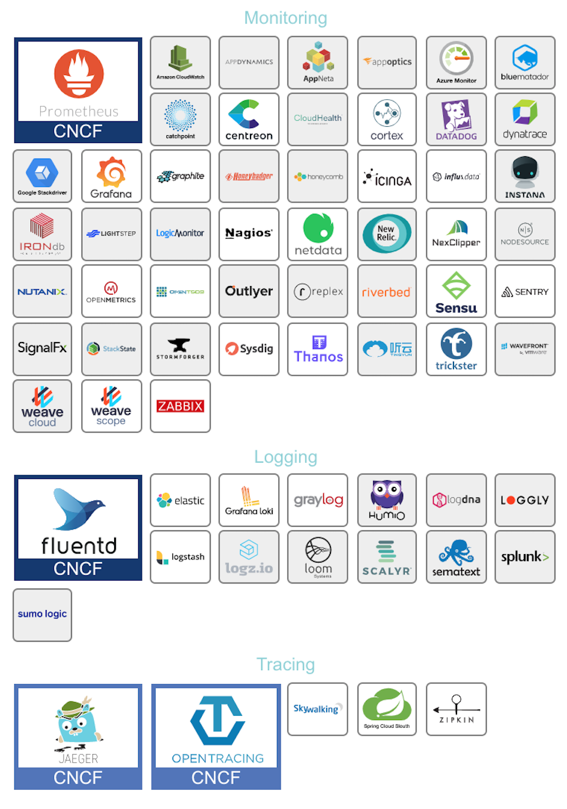

# 分布式追踪系统概述及主流开源系统对比


图片来源: Dapper, a Large-Scale Distributed Systems Tracing Infrastructure

随着应用容器化和微服务的兴起，借由Docker和 Kubernetes 等工具, 服务的快速开发和部署成为可能，构建微服务应用变得越来越简单。但是随着大型单体应用拆分为微服务，服务之间的依赖和调用变得极为复杂，这些服务可能是不同团队开发的，可能基于不同的语言，微服务之间可能是利用RPC, RESTful API, 也可能是通过消息队列实现调用或通讯。如何理清服务依赖调用关系，如何在这样的环境下快速debug, 追踪服务处理耗时，查找服务性能瓶颈, 合理对服务的容量评估都变成一个棘手的事情。

## `可观察性`(Observability) 及其三大支柱

为了应对这些问题，可观察性(Observability) 这个概念被引入软件领域。 传统的监控和报警主要关注系统的异常情况和失败因素，可观察性更关注的是从系统自身出发，去展现系统的运行状况，更像是一种对系统的自我审视。一个可观察的系统中更关注应用本身的状态, 而不是所处的机器或者网络这样的间接证据，我们希望直接得到应用当前的吞吐和延迟信息，为了达到这个目的，我们就需要合理主动暴露更多应用运行信息。在当前的应用开发环境下，面对复杂系统我们的关注将逐渐由点到点线面体的结合，这能让我们更好的理解系统，不仅知道What,  更能回答Why。

可观察性目前主要包含以下三大支柱:

- 日志(Logging):
Logging 主要记录一些离散的事件，应用往往通过将定义好格式的日志信息输出到文件，然后用日志收集程序收集起来用于分析和聚合。目前已经有 ELK 这样的成熟方案, 相比之下日志记录的信息最为全面和丰富，占用的存储资源正常情况下也最多，虽然可以用时间将所有日志点事件串联起来，但是却很难展示完整的调用关系路径。

- 度量(Metrics)
Metric 往往是一些聚合的信息，相比Logging 丧失了一些具体信息，但是占用的空间要比完整日志小的多，可以用于监控和报警，在这方面 Prometheus 已经基本上成为了事实上的标准。

- 分布式追踪(Tracing)
Tracing 介于Logging 和 Metric 之间， 以请求的维度，串联服务间的调用关系并记录调用耗时，即保留了必要的信息，又将分散的日志事件通过 Span 串联， 帮助我们更好的理解系统的行为、辅助调试和排查性能问题，也是本文接下来介绍的重点。

Logging，Metrics 和 Tracing既各自有其专注的部分，也有相互重叠的部分。


图片来源：Metrics, tracing, and logging

近年来Metric和Tracing有融合的趋势，现在很多流行的APM(应用性能管理)系统，如Datadog 就融合了Tracing和Metric信息。

就在写这篇文章的同时，在kubecon 2019 CNCF 宣布 OpenTracing 和 Google 的 OpenCensus 项目合并。目前新项目仍然还在建设中，不过已经承诺了对现有 OpenTracing 提供兼容。

下面是CNCF 总结的当前流行的实现可观察性系统的常见软件或服务，Monitoring 栏中以Prometheus 为代表，本身可以实现Metric的收集监控和报警，不过结合图中其他工具可以实现更加强大的监控方案。


图片来源: CNCF Cloud Native Landscape

## 分布式追踪系统（Tracing）定位及其标准

### Tracing的功能定位

- 故障定位——可以看到请求的完整路径，相比离散的日志, 更方便定位问题(由于真实线上环境会设置采样率，可以利用debug开关实现对特定请求的全采样)
- 依赖梳理——基于调用关系生成服务依赖图
- 性能分析和优化——可以方便的记录统计系统链路上不同处理单元的耗时占用和占比
- 容量规划与评估
- 配合Logging和Metric强化监控和报警

让 Tracing 流行起来最早由于 Google 的论文 【Dapper, a Large-Scale Distributed Systems Tracing Infrastructure】, Twitter基于这篇论文开发了 Zipkin 并开源了这个项目。再之后业界百花齐放，诞生了一大批开源和商业 Tracing 系统。

### OpenTracing 标准

由于近年来各种链路监控产品层出不穷，当前市面上主流的工具既有像 Datadog 这样的一揽子商业监控方案，也有 AWS X-Ray 和 Google Stackdriver Trace 这样的云厂商产品，还有像Zipkin、Jaeger这样的开源产品。

云原生基金会(CNCF) 推出了 OpenTracing 标准，推进Tracing协议和工具的标准化, 统一 Trace 数据结构和格式。 OpenTracing 通过提供平台无关、厂商无关的 API，使得开发人员能够方便的添加（或更换）追踪系统的实现。比如从Zipkin替换成Jaeger/Skywalking等后端。

在 `OpenTracing` 中，主要定义以下基本概念

- > 1、Trace(调用链): OpenTracing中的Trace（调用链）通过归属于此调用链的Span来隐性的定义。一条Trace（调用链）可以被认为是一个由多个Span组成的有向无环图（DAG图）， Span与Span的关系被命名为References。
- > 2、Span(跨度)：可以被翻译为跨度，可以被理解为一次方法调用, 一个程序块的调用, 或者一次RPC/数据库访问. 只要是一个具有完整时间周期的程序访问，都可以被认为是一个span

单个Trace中，span间的因果关系

```bash
        [Span A]  ←←←(the root span)
            |
     +------+------+
     |             |
 [Span B]      [Span C] ←←←(Span C 是 Span A 的孩子节点, ChildOf)
     |             |
 [Span D]      +---+-------+
               |           |
           [Span E]    [Span F] >>> [Span G] >>> [Span H]
                                       ↑
                                       ↑
                                       ↑
                         (Span G 在 Span F 后被调用, FollowsFrom)
```

每个Span包含的操作名称、开始和结束时间、附加额外信息的Span Tag、可用于记录Span内特殊事件Span Log、用于传递Span上下文的SpanContext和定义Span之间关系的References。

关于SpanContext

SpanContext 是 OpenTracing 中非常重要的概念，在创建Span、向传输协议Inject（注入）和从传输协议中Extract（提取）调用链信息时，SpanContext发挥着重要作用。


图片来源: Jaeger Architecture

SpanContext数据结构如下：

```bash
SpanContext:
- trace_id: "abc123"
- span_id: "xyz789"
- Baggage Items:
  - special_id: "vsid1738"
```

- trace_id 和 span_id 区分Trace中的Span
- Baggage Items 和 Span Tag 结构相同，唯一的区别是，Span Tag只在当前Span中存在，并不在整个trace中传递，而Baggage Items 会随调用链传递。

在跨界(跨服务或者协议）传输过程中实现调用关系的传递和关联，需要能够将 SpanContext向下游介质的注入，并在下游传输介质中提取 SpanContext。

往往可以使用协议本身的提供的类似HTTP Headers的机制实现这样的信息传递，像Kafka这样的消息中间件也有提供实现这样功能的Headers机制。

OpenTracing 实现，可以使用 api 中提供的 Tracer.Inject(...) 和 Tracer.Extract(...) 方便的实现 SpanContext 的注入和提取。

下面是伪代码示例：

```python
# 下面是调用方注入的过程
span_context = ...
outbound_request = ...

carrier = {}
tracer.inject(span_context, opentracing.Format.HTTP_HEADERS, carrier)


# 下面是被调用方提取的过程
inbound_request = ...

carrier = inbound_request.headers
span_context = tracer.extract(opentracing.Format.HTTP_HEADERS, carrier)
span = tracer.start_span("...", child_of=span_context)
```

## 目前主流开源方案及对比

目前比较主流的Tracing开源方案有Jaeger、Zipkin、Apache SkyWalking、CAT、Pinpoint、Elastic APM 等，这些项目源代码现在都托管在Github上。

我们按照下面的维度进行了对比:


表格整理时间：2019年6月

### 在现有系统引入时需要考虑以下因素

1. 低性能损耗
2. 应用级的透明  尽量减少业务的侵入，目标是尽量少改或者不用修改代码
3. 扩展性

### 基于以上调研，可以总结如下

- 如果是偏向于Java栈的应用，对跨语言和定制化需求低，可以优先考虑侵入性低的 Apache SkyWalking，该项目是国人主导，有较多的公司在使用。
- 考虑多语言支持、定制化和高扩展，优先选用 Jaeger（Jaeger 与Zipkin 比较类似，且兼容Zipkin原始协议，相比之下Jaeger 有一定的后发优势),Jaeger 和Zipkin相对与其它方案，更专注与Tracing本身，监控功能比较弱。
- 偏向于纯Web应用，无需定制化且已经有搭建好的ELK日志系统可以考虑低成本的接入 Elastic APM。
- CAT 基于日志全量采集指标数据，对于大规模的采集有一定优势，且集成了完善的监控报警机制，国内使用的公司多，但其不支持 OpenTracing。
- Pinpoint最主要的特点是侵入性低，拥有完整的APM和调用链跟踪功能, 但是当前仅支持Java和PHP, 也不支持 OpenTracing标准。

## 本文引用与参考如下

1. [Dapper, a Large-Scale Distributed Systems Tracing Infrastructure](https://ai.google/research/pubs/pub36356)
2. [观察之道：带你走进可观察性](https://www.infoq.cn/article/observability-enhance)
3. [关于可观察性的三大支柱，你应该了解这些](https://www.infoq.cn/article/N64dDo-kRPvYbK4jCeET)
4. [Metrics, tracing, and logging](https://peter.bourgon.org/blog/2017/02/21/metrics-tracing-and-logging.html)
5. [Datadog APM and Distributed Tracing](https://docs.datadoghq.com/tracing/)
6. [Merging OpenTracing and OpenCensus: Goals and Non-Goals](https://medium.com/opentracing/merging-opentracing-and-opencensus-f0fe9c7ca6f0)
7. [Merging OpenTracing and OpenCensus: A Roadmap to Convergence](https://medium.com/opentracing/merging-opentracing-and-opencensus-f0fe9c7ca6f0)
8. [OpenTracing语义标准](https://github.com/opentracing-contrib/opentracing-specification-zh/blob/master/specification.md)
9. [OpenTracing Semantic Conventions](https://github.com/opentracing/specification/blob/master/semantic_conventions.md)
10. [OpenTracing Inject and extract](https://opentracing.io/docs/overview/inject-extract/)
11. [Kafka Add Record Headers](https://cwiki.apache.org/confluence/display/KAFKA/KIP-82+-+Add+Record+Headers)
12. [OpenTracing Supported tracers](https://opentracing.io/docs/supported-tracers/)
13. [APM和调用链跟踪](https://skywalking.apache.org/zh/blog/2019-03-29-introduction-of-skywalking-and-simple-practice.html)
14. [Jaeger vs Apache Skywalking](https://blog.getantler.io/jaeger-vs-apache-skywalking/)
15. [分布式跟踪、开放式跟踪和 Elastic APM](https://www.elastic.co/cn/blog/distributed-tracing-opentracing-and-elastic-apm)
