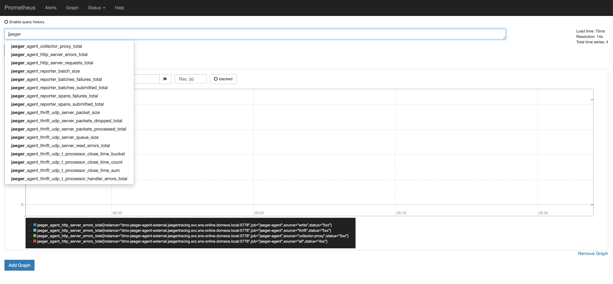

# 利用Jaeger打造云原生架构下分布式追踪系统


上一篇主要介绍了 分布式追踪的原理和 `OpenTracing` 协议，并比较了当前主流的分布式追踪开源方案。本篇以 `Jaeger` 为例，介绍如何使用`Jaeger` 搭建云原生架构下的分布式追踪系统。

## 为什么选择Jaeger

### 优点

- `Jaeger`由Uber开源并被云原生基金会(`CNCF`)纳入孵化项目，背后有大厂和强大的组织支持，项目目前开发活跃；
- 原生支持 `OpenTracing` 标准(可以认为是`OpenTracing`协议的参考实现), 支持多种主流语言, 可以复用大量的 `OpenTracing` 组件；
- 丰富的采样率设置支持；
- 高扩展，易伸缩, 没有单点故障，可以随着业务方便扩容；
- 多种存储后端支持；
- 提供现代的 `Web UI`，可以支持大量数据的呈现；
- 支持云原生的部署方式，非常容易部署在 `Kubernetes` 集群中；
- 可观察性 所有组件默认均可暴露 `Prometheus metrics`, 日志默认使用结构化的日志到标准输出。

### 缺点

- 接入过程有一定的侵入性；
- 与上篇介绍的 `Apache SkyWalking` 、`CAT` 相比，`Jaeger`更专注于链路追踪(`Tracing`), 日志和指标功能支持比较有限；
- 本身缺少监控和报警机制，需要结合第三方工具来实现，比如配合`Grafana` 和 `Prometheus`实现。文章后面会给出简单的示例。

## 实现原理

### 架构图解


图片来源: Jaeger Architecture

### Jaeger组件

- 客户端库 实现了`OpenTarcing API`. 可以手动也可以通过已经集成`OpenTracing` 的框架工具实现应用的分布式追踪，像 `Flask`, `Dropwizard`, `gRPC` 等都已经有现成的集成工具库。

- 每当接受到新的请求，就会创建 `span` 并关联上下文信息（`trace id`、`span id` 和 `baggage`）。只有 `id` 和 `baggage` 会随请求向下传递，而所有组成 `span` 的其他信息，如操作名称、日志等，不会在同一个`trace` 的`span`间传递。通过采样得到的 `span` 会在后台异步发送到 `Jaeger Agents` 上。

- 需要注意的是虽然所有的`traces`都会创建，但是只有少部分会被采样，采样到的`trace`会被标记并用于后续的处理和存储。默认情况下，`Jaeger client` 的采样率是 `0.1%`, 也就是 千分之一，并且可以从 `Agent`上取回采样率设置。

- `Agent` 是一个网络守护进程，监听通过 `UDP` 发送过来的 `spans`，并将其批量发送给 `Collector`。按设计 `Agent` 要作为基础设施被部署到所有主机节点。`Agent` 将 `Collector` 和客户端之间的路由与发现机制抽象了出来。后面会详细介绍`Agent`的部署模式。

- `Collector` 从 `Agents` 接收 `traces`，并通过一个`pipeline`对其进行处理。目前的`pipeline`会检验`traces`、建立索引、执行转换并最终进行存储。`Jaeger`的存储系统是一个可插入的组件，当前支持 `Cassandra`, `Elasticsearch` 和 `Kafka`（测试环境可以支持纯内存存储)。

- `Query` 从存储中检索 `traces` 并通过 一个漂亮的 `UI` 界面进行展现，目前支持搜索、过滤，`traces` 对比、查看依赖调用关系图等功能。

### 关于采样率

分布式追踪系统本身也会造成一定的性能低损耗，如果完整记录每次请求，对于生产环境可能会有极大的性能损耗，一般需要进行采样设置。

当前支持四种采样率设置

1. 固定采样（sampler.type=const）sampler.param=1 全采样， sampler.param=0 不采样;
2. 按百分比采样（sampler.type=probabilistic）sampler.param=0.1 则随机采十分之一的样本;
3. 采样速度限制（sampler.type=ratelimiting）sampler.param=2.0 每秒采样两个traces;
4. 动态获取采样率 (sampler.type=remote) 这个是默认配置， 可以通过配置从 Agent 获取采样率的动态设置。

自适应采样（`Adaptive Sampling`）也已经在开发计划中

## 部署实践

### 在Kubernetes集群上部署Jaeger

Jaeger是为云原生环境下的分布式追踪而打造，`Kubernetes` 又是当前云原生服务编排事实上的标准，下面以示例的方式介绍如何在 `Kubernetes`集群上部署 `Jaeger`。

```bash
# 克隆示例到本地
git clone https://github.com/maguowei/distributed-tracing-system.git
cd distributed-tracing-system

# 这里我们选择Elasticsearch作为存储, 简单创建测试用的 Elasticsearch 服务
kubectl create -f deployment/kubernetes/elasticsearch

# 部署Jaeger全家桶(Agent, Collector, Query)
kubectl create -f deployment/kubernetes/jaeger

# 以NodePort 方式暴露 Query UI
kubectl expose service jaeger-query --port 16686 --type NodePort --name jaeger-query-node-port

# 找到暴露的端口号
kubectl get service jaeger-query-node-port

# 访问 http://127.0.0.1:${port}

```


当前Query 中可以看到是空的，我们运行 官方的 HotROD 微服务示例，生成一些数据：

```bash
kubectl create -f deployment/kubernetes/example
kubectl expose service jaeger-example-hotrod --port 8080 --type NodePort --name jaeger-example-hotrod-node-port
```

打开`HotROD`页面, 任意点击页面上的按钮，生成一些调用数据:


刷新Jaeger Query UI 页面，然后我们就可以看到生成的调用信息:


点开具体的一条Trace 可以看到详细的调用过程:


还可以看到图形化的调用关系链:


### 选择 `DaemonSet` 还是 `Sidecar`

`Agent` 官方目前有两种部署方案， 一种是 `DaemonSet` 方式， 一种是 `Sidecar` 方式。

按照官方的说法，`Jaeger` 中的 `Agent` 组件是作为 `tracer` 和 `Collector` 之间的 `buffer`， 所以 `Agent` 应该离 `tracer` 越近越好，通常应该是 `tracer` 的 `localhost`， 基于这样的假定，`tracer` 能够直接通过`UDP`发送`span` 到 `Agent`，达到最好的性能和可靠性之间的平衡。

这样的假定在裸机服务器上部署非常棒，但在当前流行的云环境和容器中，对于 `Kubernetes` 来说究竟是么是本地（`localhost`）呢？ 是服务运行所在的节点(`node`)还是 `pod` 本身呢？

`DaemonSet` 的 `pod` 运行在节点(`node`)级别，这样的`pod`如同每个节点上的守护进程，`Kubernetes` 确保每个节点有且只有一个 `Agent pod`运行, 如果以 `DaemonSet` 方式部署，则意味着这个 `Agent` 会接受节点上所有应用`pods`发送的数据，对于 `Agent` 来说所有的 `pods` 都是同等对待的。这样确实能够节省一些内存，但是一个 `Agent` 可能要服务同一个节点上的数百个 `pods`。

`Sidecar` 是在应用 `pod` 中增加其他服务，在`Kubernetes` 中服务是以 `pod` 为基本单位的，但是一个 `pod` 中可以包含多个容器, 这通常可以用来实现嵌入一些基础设施服务， 在 `Sidecar` 方式部署下，对于 `Jaeger Agent` 会作为 `pod` 中的一个容器和 `tarcer` 并存，由于运行在应用级别，不需要额外的权限，每一个应用都可以将数据发送到不同的 `Collector` 后端。这样能保证更好的服务扩展性。现在非常火的服务网格(`Service Mesh`) 往往也是利用 `Sidecar`模式，实现服务的监控、限流，熔断、日志收集等功能。

总结来说，基于你的部署架构，如果是私有云环境，且信任 `Kubernetes` 集群上运行的应用，可能占用更少内存的 `DaemonSet` 会适合你。如果是公有云环境，或者希望获得多租户能力，`Sidecar` 可能更好一些，由于 `Agent` 服务当前没有任何安全认证手段，这种方式不需要在 `pod` 外暴露`Agent`服务，相比之下更加安全一些，尽管内存占用会稍多一些（每个 `Agent` 内存占用在`20M`以内）。

#### Agent 以 DaemonSet 模式部署

DaemonSet 方式部署会有一个问题，如何保证应用能够和自己所在节点的`Agent`通讯？

为解决通讯问题 Agent需要使用主机网络（`hostNetwork`）, 应用中需要借用 `Kubernetes Downward API` 获取节点IP信息。

DaemonSet 模式部署 Agent

```yaml
apiVersion: apps/v1
kind: DaemonSet
metadata:
  name: jaeger-agent
  labels:
    app: jaeger-agent
spec:
  selector:
    matchLabels:
      app: jaeger-agent
  template:
    metadata:
      labels:
        app: jaeger-agent
    spec:
      containers:
        - name: jaeger-agent
          image: jaegertracing/jaeger-agent:1.12.0
          env:
            - name: REPORTER_GRPC_HOST_PORT
              value: "jaeger-collector:14250"
          resources: {}
      hostNetwork: true
      dnsPolicy: ClusterFirstWithHostNet
      restartPolicy: Always
```

通过 `Kubernetes Downward API` 将节点的IP信息(`status.hostIP`) 以环境变量的形式注入到应用容器中：

```yaml
apiVersion: apps/v1
kind: Deployment
metadata:
  name: myapp
spec:
  selector:
    matchLabels:
      app: myapp
  template:
    metadata:
      labels:
        app: myapp
    spec:
      containers:
      - name: myapp
        image: example/myapp:version
        env:
        - name: JAEGER_AGENT_HOST
          valueFrom:
            fieldRef:
              fieldPath: status.hostIP
```

#### Agent以Sidecar模式部署

下面是以`Sidecar`模式运行的应用示例，官方也提供了自动注入`Sidecar`的机制，详细使用可以参考[12]。

```yaml
apiVersion: apps/v1
kind: Deployment
metadata:
  name: myapp
  labels:
    app: myapp
spec:
  replicas: 1
  selector:
    matchLabels:
      app: myapp
  template:
    metadata:
      labels:
        app: myapp
    spec:
      containers:
        - name: myapp
          image: example/myapp:version
        - name: jaeger-agent
          image: jaegertracing/jaeger-agent:1.12.0
          env:
            - name: REPORTER_GRPC_HOST_PORT
              value: "jaeger-collector:14250"
```

这样 `Jaeger Agent` 将会监听 `localhost:5775`/`localhost:6831`/`localhost:6832`/`localhost:5778` 这些本地端口，通常你不需要再在client配置中指定连接的主机名或者端口信息，应为这都是默认值。

### 生成依赖调用关系图

`Jaeger Query UI`服务中的 `dependencies` 选项默认点开为空，需要运行 `spark-dependencies` 来生成依赖关系图。

`spark-dependencies` 是一个`Spark job` 可以通过聚合和分析存储中的 `trace` 数据，生成服务间的依赖关系图，并将依赖链接信息持久化到存储中。 之后 `Jaeger Query Dependencies` 页面就可以显示服务之间的依赖关系。

```bash
# 可以手动只执行一次
kubectl run -it --rm jaeger-spark-dependencies --env=STORAGE=elasticsearch --env ES_NODES=http://jaeger-elasticsearch:9200 --env ES_NODES_WAN_ONLY=true --restart=Never --image=jaegertracing/spark-dependencies

# 也可以创建 CronJob， 每天定点生成新的依赖图
kubectl create -f deployment/kubernetes/spark-dependencies/jaeger-spark-dependencies-cronjob.yaml
```


### 应用示例

下面以`Python` `Django`项目为例在服务中集成 `Jaeger`。

安装必要的依赖

```bash
pip install jaeger-client
pip install django_opentracing
```

`Jaeger tracer` 配置和初始化：

```python
from jaeger_client import Config
from django.conf import settings


def init_jaeger_tracer(service_name='your-app-name'):
    config = Config(
        config={
            'sampler': {
                'type': 'const',
                'param': 1,
            },
            'local_agent': {
                'reporting_host': settings.JAEGER_REPORTING_HOST,
                'reporting_port': settings.JAEGER_REPORTING_PORT,
            },
            'logging': True,
        },
        service_name='django-example',
        validate=True,
    )
    return config.initialize_tracer()


# this call also sets opentracing.tracer
jaeger_tracer = init_jaeger_tracer(service_name='example')
```

`Django_opentracing` 配置, 在`Django settings`文件中增加以下配置：

```python

import django_opentracing

...

# 添加 django_opentracing.OpenTracingMiddleware
MIDDLEWARE = [
    'django_opentracing.OpenTracingMiddleware',
    ... # other middleware classes
]

# OpenTracing settings

OPENTRACING_SET_GLOBAL_TRACER = True

# if not included, defaults to True.
# has to come before OPENTRACING_TRACING setting because python...
OPENTRACING_TRACE_ALL = True

# defaults to []
# only valid if OPENTRACING_TRACE_ALL == True
OPENTRACING_TRACED_ATTRIBUTES = ['path', 'method']

from example.service.jaeger import jaeger_tracer

OPENTRACING_TRACER = django_opentracing.DjangoTracing(jaeger_tracer)
```

这样`Django`接收的每个请求都会生成一条单独的`Trace`，当前请求的`path`和`method`会以`Span Tag` 的形式记录下来。

手动创建`Span`和记录调用信息等更详尽的使用方法，请参考官方使用文档。

#### 监控和报警

当前Jaeger缺少自带的报警机制，但是由于存储可以使用Elasticsearch, 配合Grafana就可以实现简单的报警监控。

Jaeger本身暴露了Prometheus 格式的 metrics 信息， 配合 Grafana可以方便的监控 Jaeger本身的运行状态。


## 资源清理

演示完毕，最后做一下资源的清理和释放

```bash
kubectl delete -f deployment/kubernetes/spark-dependencies
kubectl delete -f deployment/kubernetes/example
kubectl delete -f deployment/kubernetes/jaeger
kubectl delete -f deployment/kubernetes/elasticsearch
kubectl delete service jaeger-example-hotrod-node-port
kubectl delete service jaeger-query-node-port
```

## 本文引用与参考如下

1. [Jaeger Supported libraries](https://www.jaegertracing.io/docs/1.12/client-libraries/#supported-libraries)
2. [OpenTracing API Contributions](https://github.com/opentracing-contrib)
3. [Jaeger Features](https://www.jaegertracing.io/docs/1.12/features/)
4. [Jaeger Roadmap](https://www.jaegertracing.io/roadmap/)
5. [Jaeger Sampling](https://www.jaegertracing.io/docs/1.12/sampling/)
6. [Jaeger Architecture](https://www.jaegertracing.io/docs/1.12/architecture/)
7. [Deployment strategies for the Jaeger Agent](https://medium.com/jaegertracing/deployment-strategies-for-the-jaeger-agent-1d6f91796d09)
8. [Kubernetes DNS 高阶指南](https://juejin.im/entry/5b84a90f51882542e60663cc)
9. [Kubernetes Communicating with Daemon Pods](https://kubernetes.io/docs/concepts/workloads/controllers/daemonset/#communicating-with-daemon-pods)
10. [Kubernetes Docs - Expose Pod Information to Containers Through Files](https://kubernetes.io/docs/tasks/inject-data-application/downward-api-volume-expose-pod-information/)
11. [Jaeger Kubernetes - Deploying the agent as sidecar](https://github.com/jaegertracing/jaeger-kubernetes#deploying-the-agent-as-sidecar)
12. [Jaeger Operator for Kubernetes - Auto injection of Jaeger Agent sidecars](https://github.com/jaegertracing/jaeger-operator#auto-injection-of-jaeger-agent-sidecars)
13. [Take OpenTracing for a HotROD ride](https://medium.com/opentracing/take-opentracing-for-a-hotrod-ride-f6e3141f7941)
14. [opentracing-contrib/python-django](https://github.com/opentracing-contrib/python-django)
15. [Monitoring Jaeger](https://www.jaegertracing.io/docs/1.12/monitoring/)
